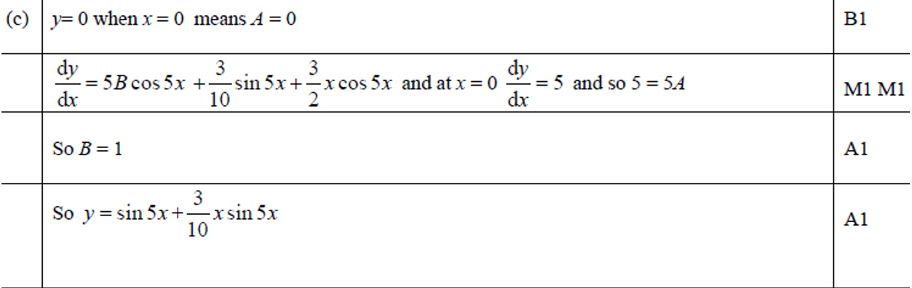

# Core Pure Chapter 7: Differential Equations
---

<h3> Context and Background:  </h6>

The differential equations that we will see in this chapter are all derivatives with respect to $x$. We call these type of differential equations Ordinary Differential Equations (ODE) 

<!-- .element: class="fragment" --> 

In contrast, there are differential equations that involve derivatives of multiple variables. They are known as Partial Differential Equations (PDE)
<!-- .element: class="fragment" --> 

Fortunately, we don't do PDEs in our specification. So, all references to "differential equations" means ODEs. 
<!-- .element: class="fragment" -->

In this chapter, all Calculus knowledge will be needed. 
<!-- .element: class="fragment" -->

A lot of this is used in physics (as we will see more in the next chapter). To get you prepared, many of the following practices do come from a physics background (I tried to keep it within A-level)
<!-- .element: class="fragment" -->

---

<h3> History:  </h6>

Since the invention of Calculus by Sir Isaac Newton and Gottfried Leibniz, differential equations came to birth. <!-- .element: class="fragment" data-fragment-index="1"-->

Newton proposed and solved the following differential equations in his publication in 1671 Method of Fluxions 
<!-- .element: class="fragment" data-fragment index ="2"-->

$$\frac{dy}{dx} = f(x)$$
<!-- .element: class="fragment" data-fragment index ="2"-->

$$\frac{dy}{dx} = f(x, y)$$
<!-- .element: class="fragment" data-fragment index ="2"-->

$$x_{1}\frac{\partial y}{\partial x_{1}} + x_{2}\frac{\partial y}{\partial x_{2}} = y$$
<!-- .element: class="fragment" data-fragment index ="2"-->

where $y$ is an unknown function of $x$ (or $x_{1}, x_{2}$). 
<!-- .element: class="fragment" data-fragment index ="2"-->

---

<h3> History:  </h6>

Later on, Jacob Bernoulli proposed the Bernoulli differential equation in 1695, which are differential equations in the form: 
<!-- .element: class="fragment" data-fragment-index="1"-->

$y' + P(x)y = Q(x)y^{n}$
<!-- .element: class="fragment" data-fragment-index="2"-->

On the following year, Leibniz provided the general solution by simplifying it. 
<!-- .element: class="fragment" data-fragment-index="3"-->

After them, greats like Leonhard Euler, Daniel Bernoulli, and Joseph-Louis Lagrange (to name a few) 
<!-- .element: class="fragment" data-fragment-index="4"-->

---

<b><h3>Chapter Objective</h3></b>

- Solve First Order ODEs <!-- .element: class="fragment" -->
- Solve Second Order ODEs <!-- .element: class="fragment" -->

---
## Part 1: First Order Differential Equations: 
---

We have different ways of expressing a derivative: <!-- .element: class="fragment"-->
$$f'(x), \frac{dy}{dx},\dot{x}, y' ...$$<!-- .element: class="fragment" -->

In this part, we will typically use $\frac{dy}{dx}$ to express our equations. This will come in handy later. 
<!-- .element: class="fragment" --> 

---

<h3> Example 1.1:  </h6>

$\frac{dy}{dx} = xy$ 
<!-- .element: class="fragment"-->

<!--We can treat $\frac{dy}{dx}$ as a fraction, where $dx$ is the denominator and $dy$ is the numerator. -->

<!--Now, we perform 'variable separation', where we try to get all $x$ on one side and all $y$ on the other side: -->

$\frac{dy}{y} = x dx$
<!-- .element: class="fragment"-->

Integrate both sides:
<!-- .element: class="fragment"-->

$\int \frac{dy}{y} = \int x dx$
<!-- .element: class="fragment"-->

$\ln |y| = \frac{1}{2}x^{2} + c$
<!-- .element: class="fragment"-->

$y = \pm K e^{\frac{1}{2}x^{2}}$ where $K = e^{c}$
<!-- .element: class="fragment"-->

Now, we have found a general solution to the original differential equation. 
<!-- .element: class="fragment"-->

---

In general, a first order differential equation can be written in the form: 
<!-- .element: class="fragment"-->

$\frac{dy}{dx} = f(x)g(y)$
<!-- .element: class="fragment"-->

and can be solved by variable separation : 
<!-- .element: class="fragment"-->

$\int \frac{dy}{g(y)} = \int f(x)dx$
<!-- .element: class="fragment"-->

The particular solution can be found when the question specified conditions. 
<!-- .element: class="fragment"-->

---

<b2><h3>Practice 1.1: Non-physics ones</h3></b2>

Find the general solution to the following differential equations: 

$$(a)\ \frac{dy}{dx}=x\cos ^{2} y$$

$$(b)\ \frac{dy}{dx}=e ^{x+y}$$

$$(c)\ \frac{dy}{dx}=e ^{x-y}$$

---

<b2><h3>Practice 1.2: Discharging Capacitor </h3></b2>

Derive the equation for a discharging capacitor, given that at time $t=0$, charge $Q=Q_0$, by solving the following differential equation. 

$\frac{dQ}{dt}R=\frac{Q}{C}$

Note that all variables are $\ge 0$, and treat $R$ and $C$ as constants
<!-- .element: class="fragment"-->

---

<b2><h3>Practice 1.3: Charging Capacitor</h3></b2>

Derive the equation for charging capacitor, given that at time $t=0$, charge $Q=0$, by solving the following differential equation. 

$\frac{dQ}{dt} R + \frac{Q}{C} = \epsilon$

Note that all variables are $\ge 0$, and treat $R$, $C$, and $\epsilon$ as constants
<!-- .element: class="fragment"-->

---

Unfortunately, not all first order differential equations are like the ones given above.

---

<b2><h3>Example 1.2: </h3></b2>

$\frac{dy}{dx} + y = x $
<!-- .element: class="fragment"-->

<!-- we realize that this cannot be solved using only variable separation because you cannot separate the variables-->

<!-- thankfully, there is a trick that we can use-->

Recall implicit differentiation: $(f(x)g(y))' = f'(x)g(y) + f(x)g'(y)\frac{dy}{dx}$
<!-- .element: class="fragment"--> 

<!-- if we can try to fit the equation to this expression, we could simplify the terms on the LHS-->

Multiply both sides with $e^{x}$: 
<!-- .element: class="fragment"--> 

$e^{x}\frac{dy}{dx} + e^{x}y = xe^{x}$
<!-- .element: class="fragment"--> 

<!-- now we recognise the usage of product rule-->

Simplify: $\frac{d}{dx} \left(e^{x} y \right) =xe^{x}$
<!-- .element: class="fragment"--> 

Now, we can separate variables and integrate: 
<!-- .element: class="fragment"--> 

$e^{x} y = \int xe^{x} dx$
<!-- .element: class="fragment"--> 

By partial integration and some rearranging, we get $y=x-1+Ce^{-x}$
<!-- .element: class="fragment"--> 

---

For first order differential equations in the form of: 
<!-- .element: class="fragment"-->

$$\frac{dy}{dx} + P(x)y=Q(x)$$
<!-- .element: class="fragment"-->

we can multiply each term by the integrating factor  $e^{\int P(x) dx}$ and use product rule to simplify the equation into: 
<!-- .element: class="fragment"-->

$$\frac{d}{dx}e^{\int P(x)dx}y=e^{\int P(x)dx}Q(x)$$
<!-- .element: class="fragment"-->

by product rule and solve for $y$. 
<!-- .element: class="fragment"-->

It is worth noting that we can safely ignore the $+C$ for the integration on the exponential. 
<!-- .element: class="fragment"-->

--

We can easily prove the integrating factor. 
<!-- .element: class="fragment" data-fragment-index="1"-->

For differential equations in the form
<!-- .element: class="fragment" data-fragment-index="2"-->

$$\frac{dy}{dx} + P(x)y=Q(x)$$
<!-- .element: class="fragment" data-fragment-index="2"-->

We can multiply it by an integrating factor $f(x)$
<!-- .element: class="fragment" data-fragment-index="3"-->

$$f(x)\frac{dy}{dx} + f(x)P(x)y=f(x)Q(x)$$
<!-- .element: class="fragment" data-fragment-index="3"-->

If we can use the product rule, then LHS must be in the format
<!-- .element: class="fragment" data-fragment-index="4"-->

$$f(x)\frac{dy}{dx}+f'(x)y$$
<!-- .element: class="fragment" data-fragment-index="4"-->

Equating coefficients and solving for $f(x)$
<!-- .element: class="fragment" data-fragment-index="5"-->

$$f(x)P(x)=f'(x)$$
<!-- .element: class="fragment" data-fragment-index="6"-->

$$P(x)=\frac{f'(x)}{f(x)}\implies \int P(x)dx=\int\frac{f'(x)}{f(x)}=\ln f(x)$$
<!-- .element: class="fragment" data-fragment-index="7"-->

Hence: $f(x)=e ^{\int P(x)dx}$
<!-- .element: class="fragment" data-fragment-index="8"-->

---

<b><h3>Practice 1.4: Non-physics ones</h3></b>

Find the general solution to the following differential equations: 

$$(a)\ 4xy\frac{dy}{dx}+2y^2=x^2$$

$$(b)\ x^2\frac{dy}{dx}+2xy=2x+1$$

$$(c) \frac{dy}{dx}+y\cot x =1$$

---

<b><h3>Practice 1.5: Reattempt Charging Capacitor</h3></b>

Using your newly taught skills, derive the equation for charging capacitor, given that at time $t=0$, charge $Q=0$, by solving the following differential equation. 

$\frac{dQ}{dt} R + \frac{Q}{C} = \epsilon$

Note that all variables are $\ge 0$, and treat $R$, $C$, and $\epsilon$ as constants
<!-- .element: class="fragment"-->

As an extension, think about why both methods worked for this differential equation. 
<!-- .element: class="fragment"-->

---

<b><h3>Practice 1.6: Velocity-dependent Drag</h3></b>

A ball is dropped from a sufficient height and is in free fall, experiencing a variable resistive force $F_{drag} = 10^{-7}v$. Find the function of velocity with respect to time. 

Hint: $m\frac{dv}{dt} = mg - 10^{-7}v$
<!-- .element: class="fragment"-->

---
<!-- .slide: data-auto-animate -->

<b><h3>Exam Style Practice 1: </h3></b>

Find the general solution of the differential equation 

$$x\frac{dy}{dx}+5y=\frac{\ln x}{x}, \ x>0$$

--
<!-- .slide: data-auto-animate -->

<b><h3>Exam Style Practice 1: </h3></b>

Find the general solution of the differential equation 

$$x\frac{dy}{dx}+5y=\frac{\ln x}{x}, \ x>0$$

---
## Part 2: Second Order Differential Equations
---
<!-- .slide: data-auto-animate -->
We shall begin by studying the  Homogeneous Linear Second Order Differential Equation

$$a\frac{d^2y}{dx^2}+b\frac{dy}{dx}+cy=0$$

 

--
<!-- .slide: data-auto-animate -->

$$a\frac{d^2y}{dx^2}+b\frac{dy}{dx}+cy=0$$

Quadratic Equation: 
$$am^2+bm+c=0$$
<!-- .element: class="fragment"-->

We call this the auxiliary equation 
<!-- .element: class="fragment"-->

$\Delta = b^{2} -4ac$
<!-- .element: class="fragment"-->

---

<b><h3>General Solutions: </h3></b>

If $\Delta >0,\ m=m_1, m_2$ 
<!-- .element: class="fragment" data-fragment-index="1"-->
$$y = Ae^{m_1 x}+Be^{m_2 x}$$
<!-- .element: class="fragment" data-fragment-index="2"-->

If $\Delta = 0, m = m$ 
<!-- .element: class="fragment" data-fragment-index="3"-->

$$y = (Ax+B)e^{mx}$$
<!-- .element: class="fragment" data-fragment-index="4"-->

If $\Delta <0,\ m=p\pm qi$
<!-- .element: class="fragment" data-fragment-index="5"-->

$$y=e^{px}(A\cos qx+B\sin qx)$$
<!-- .element: class="fragment" data-fragment-index="6"-->

---

<b2><h3>Example 2.1: </h3></b2>

$$\frac{d^{2}y}{dx^{2}}+2\frac{dy}{dx}+y=0$$
<!-- .element: class="fragment"-->

Solve equation: $m^2+2m+1=0$
<!-- .element: class="fragment"-->

$m=-1$
<!-- .element: class="fragment"-->

Substitute into general solution expression: 
<!-- .element: class="fragment"-->

$$y = (Ax+B)e^{mx}=(Ax+B)e^{-x}$$
<!-- .element: class="fragment"-->

where $A, B$ are constants to be determined
<!-- .element: class="fragment"-->

---

<b><h3>Practice 2.1: </h3></b>

Find the general solution of the equations: 

$$(a)\ 2\frac{d^2y}{dx^2}+5\frac{dy}{dx}+3y=0$$

$$(b)\ y''-6y'+9y=0$$

$$(c)\ f''(x)-6f'(x)+34f(x)=0$$

---
<!-- .slide: data-auto-animate -->
What we have talked about are homogeneous equations, where the differential equation equals $0$. 
<!-- .element: class="fragment" data-fragment-index="1"-->

When the equation is in the form: 
<!-- .element: class="fragment" data-fragment-index="2"-->

$$ay''+by'+cy=f(x)$$

<!-- .element: class="fragment" data-fragment-index="2"-->

This is called Heterogeneous (or  Non-homogeneous) equation. 
<!-- .element: class="fragment" data-fragment-index="3"-->

---

<!-- .slide: data-auto-animate -->

$$ay''+by'+cy=f(x)$$

To solve non-homogeneous equations, first treat the equation as a homogeneous one: 
<!-- .element: class="fragment"-->

$$ay''+by'+cy=0$$
<!-- .element: class="fragment"-->

The general solution of this differential equation will make up the complementary function (C.F.). 
<!-- .element: class="fragment"-->

Then find an appropriate particular integral (P.I.) for the function $f(x)$
<!-- .element: class="fragment"-->

This is done by substituting and matching coefficients. 
<!-- .element: class="fragment"-->

Finally, the general solution is equal to
<!-- .element: class="fragment"-->

$$y=\text{C.F.} +\text{P.I.}$$
<!-- .element: class="fragment"-->

---

| Form of $f(x)$                      | Form of particular integral                 |
| ----------------------------------- | ------------------------------------------- |
| $p$                                 | $\lambda$                                   |
| $p + qx$                            | $\lambda + \mu x$                           |
| $p + qx + rx^2$                     | $\lambda + \mu x + vx^2$                    |
| $pe^{kx}$                           | $\lambda e^{kx}$                            |
| $p \cos \omega x$                   | $\lambda \cos \omega x + \mu \sin \omega x$ |
| $p \sin \omega x$                   | $\lambda \cos \omega x + \mu \sin \omega x$ |
| $p \cos \omega x + q \sin \omega x$ | $\lambda \cos \omega x + \mu \sin \omega x$ |

You need to memorize this
<!-- .element: class="fragment"-->

---

Note that if $f = f_1\times f_2$, then the particular integral for $f$ will be the product of the particular integrals of functions $f_1$ and $f_2$
<!-- .element: class="fragment"-->

A tricky part is that the P.I. cannot be part of C.F., so if there is already a constant $A$ in C.F., then P.I. cannot simply be $\lambda$ 
<!-- .element: class="fragment"-->

If there is an overlap, we accommodate for this by multiplying by an $x$
<!-- .element: class="fragment"-->

---

<b2><h3>Example 2.2: </h3></b2>

$$\frac{d^{2}y}{dx^{2}}+2\frac{dy}{dx}+y=3$$
<!-- .element: class="fragment"-->

Assume LHS is homogeneous, and solve it first to find the complementary function: 
<!-- .element: class="fragment"-->

$$\frac{d^{2}y}{dx^{2}}+2\frac{dy}{dx}+y=0$$
<!-- .element: class="fragment"-->

From Example 2.1: 
<!-- .element: class="fragment"-->

$$\text{C.F.}=(Ax+B)e^{-x}$$
<!-- .element: class="fragment"-->

For a constant 3, the particular integral is $\lambda$
<!-- .element: class="fragment"-->

$$Y_p=\lambda, Y_p'=0, Y_p''=0$$
<!-- .element: class="fragment"-->

Substitute this back to the original differential equation: 
<!-- .element: class="fragment"-->

$$0+2(0)+\lambda=3 \implies \text{P.I.}=\lambda=3$$
<!-- .element: class="fragment"-->

Finally, the general solution to the differential equation is: 
<!-- .element: class="fragment"-->

$$y=\text{C.F.}+\text{P.I.}=(Ax+B)e^{-x}+3$$
<!-- .element: class="fragment"-->

---

<b2><h3>Practice 2.2: </h3></b2>

$$(a)\ \frac{d^2y}{dx^2} - 6\frac{dy}{dx} = 2x^{2} - x + 1$$

$$(b)\ \frac{d^2y}{dx^2} + 2\frac{dy}{dx} + y = 25 \cos 2x$$

$$(c)\ \frac{d^2y}{dx^2} - 2\frac{dy}{dx} = 3$$

---
<!-- .slide: data-auto-animate -->

<b2><h3>Exam Style Practice 2: </h3></b2>

(a) Find the value of $\lambda$ for which $y=\lambda 5x\sin 5x$ is a particular integral solution of the differential equation 

$$\frac{d^{2}y}{dx^{2}}+25y=3\cos5x$$

(b) Hence, find the general solution of the differential equation

$$\frac{d^{2}y}{dx^{2}}+25y=3\cos5x$$

--

<!-- .slide: data-auto-animate -->

<b2><h3>Exam Style Practice 2: </h3></b2>

(a) Find the value of $\lambda$ for which $y=\lambda 5x\sin 5x$ is a particular integral solution of the differential equation 

$$\frac{d^{2}y}{dx^{2}}+25y=3\cos5x$$

(b) Hence, find the general solution of the differential equation

$$\frac{d^{2}y}{dx^{2}}+25y=3\cos5x$$

---

So far we have ignored the constants. With additional information, we can also work out the particular solution to a differential equation using boundary conditions. 
<!-- .element: class="fragment"-->

The idea is to first find the general solution, then using the conditions to determine the constants. 
<!-- .element: class="fragment"-->

---

<b2><h3>Example 2.3: </h3></b2>

From Example 2.2, we know that the solution to 
<!-- .element: class="fragment"-->
$$\frac{d^{2}y}{dx^{2}}+2\frac{dy}{dx}+y=3$$
<!-- .element: class="fragment"-->

is $(Ax+B)e^{-x}+3$
<!-- .element: class="fragment"-->

Using boundary conditions: $\frac{dy}{dx}=0$ and $y=0$ when $x=0$
<!-- .element: class="fragment"-->

$$y=0 \implies (A(0)+B)e^0 +3=0 \implies B=-3$$
<!-- .element: class="fragment"-->

$$\frac{dy}{dx}=Ae^{-x}-Axe^{-x}-Be^{-x}+3=0$$
<!-- .element: class="fragment"-->

$$0=A-B+3\implies A+6=0\implies A=-6$$
<!-- .element: class="fragment"-->

Thus: $A = -6, B=-3$
<!-- .element: class="fragment"-->

---

<b2><h3>Practice 2.3: </h3></b2>

Find the particular solution to the following: 

(a) $\frac{d^2y}{dx^2} - y = 2e^x$, and that $\frac{dy}{dx} = 0$ and $y = 0$ when $x = 0$

(b) $\frac{d^2y}{dx^2} + 9y = \sin 3x$, and that $y=0$ and $\frac{dy}{dx}=0$ when $x=0$

(c) $\frac{d^2y}{dx^2} +5\frac{dy}{dx} +6y = e^{-x}$, and that $\frac{dy}{dx} = 2$ and $y = 0$ when $x = 0$

---
<!-- .slide: data-auto-animate -->

<b2><h3>Exam Style Practice 3: </h3></b2>

Following on Exam Practice 2: $\frac{d^{2}y}{dx^{2}} +25y=3\cos 5x$

Remember the general solution is $y=A\cos 5x + B\sin 5x +\frac{3}{10}x\sin5x$

(c) Given that $x=0$, $y=0$, and $\frac{dy}{dx}=5$, find the particular solution to this differential equation, giving your solution in the form $y=f(x)$

--
<!-- .slide: data-auto-animate -->

<b2><h3>Exam Style Practice 3: </h3></b2>

Following on Exam Practice 2: $\frac{d^{2}y}{dx^{2}} +25y=3\cos 5x$

Remember the general solution is $y=A\cos 5x + B\sin 5x +\frac{3}{10}x\sin5x$

(c) Given that $x=0$, $y=0$, and $\frac{dy}{dx}=5$, find the particular solution to this differential equation, giving your solution in the form $y=f(x)$

 

 

---

Fin

